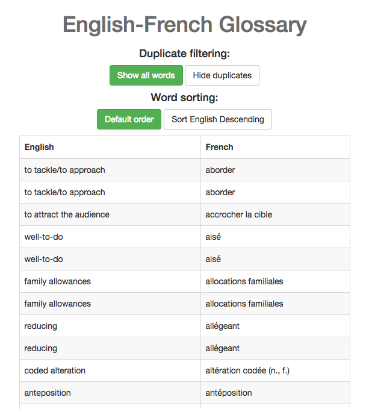

# Introduction

This application is an interactive English-French glossary using React, Redux, webpack, babel, and eslint. It can hide duplicates and alphabetically sort JSON data by either the French or English word.



# Quick start

```bash
npm install
npm run server
```

# Program notes

- The application is split into `glossary` and `link` (button) logic.

- The glossary has the following file structure: `App.js > GlossaryContainer.js > GlossaryTable.js > GlossaryEntry.js`

- The link(button) logic uses this file structure: `App.js > Links.js > GlossaryLinks.js > Link.js > GlossaryLink.js`

- The entrypoint is exported to `App.js`, which serves as a container for the glossary and filter manipulation buttons.

The redux state can be represented as the following object:

```javascript
let initialState = {
  glossary: {
    words: words,
    visibleWords: words,
    toggleDuplicates: "SHOW_DUPLICATES",
    toggleAlphabetical: "SORT_NONE"
  }
};
```

# Instructions for challenge

## TODO

For this test

- Fix the `GlossaryTable` component to display french words
- Add actions and reducers to modify the store
  - Sort words by english
  - Remove duplicates (a duplicate occurs when both english and french words of two elements are equal)
- Add bootstrap styled buttons to trigger the custom actions you created earlier

After completing the tasks please submit the completed project back in a `.zip` without version controlled or temporary files.

## Notes

This test assumes some familiarity with web developer tools.  It is also open ended in some areas - we want to see how you might approach each of the given tasks.

If you are not familiar with these tools, see the resources below and remember that we don't emphasize a time limit.

## Resources

- [React](https://facebook.github.io/react/)
- [Redux](http://redux.js.org/)
- [Webpack](https://webpack.github.io/)
